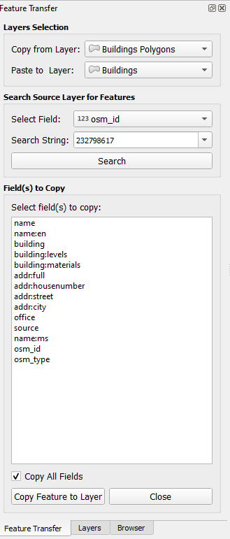
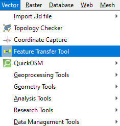

# Feature Transfer Tool

Feature Transfer Tool is a free open-source plugin for QGIS that provides a seamless way to copy and paste features between layers.

Feature Transfer Tool designed for efficiency and ease of use. To ensure the feature data accurately copy and paste.

The extension is available from the official repository [QGIS plugins page](https://plugins.qgis.org/plugins/featuretransfer/). 

Use the QGIS Plugins menu to install the Feature Transfer Tool [QGIS manual](https://docs.qgis.org/3.34/en/docs/user_manual/plugins/plugins.html).

Feature Transfer Tool is under development and test with QGIS 3.34.

## Functionality

- Allows users to select the source layer from which features will be copied.
- Allows users to select the destination layer where features will be pasted. 
- Allows users to select specific features based on selected fields.
- Provides a search function to locate features within the selected field.
- Users can choose to copy all fields or specific fields from the source layer to the target layer.
- Copies selected features from the source layer to the target layer, including their geometry and attributes. 
- The plugin ensures that fields in the target layer are compatible and will add missing fields as needed.

## Interface

  

## Tutorial 

Guide for **Feature Transfer Tool** is available here: [Feature Transfer Tool](https://gis.com.my/training/feature-transfer-tool/)

## Installation

Go to *Plugins > Manage and Install Plugins.. > All*.

Search for **Feature Transfer Tool**.

OR

Download the zip file in [Github](https://github.com/gisinnovationmy/FeatureTransferTool).

Go to *Plugins > Manage and Install Plugins.. > Install from ZIP*.

After installation, the plugin will appear under *Vector* menu.

  

## License

This plugin is distributed under GNU GPL v.2 or any later version.

## Support

We've just begun and have implemented basic functionality so far. Our goal is to expand the range of services and introduce new features.

We appreciate any feedback, and pull requests are welcome on **GitHub**.

To get started, refer to the user guide, or you can ask questions and share comments in the discussion section.